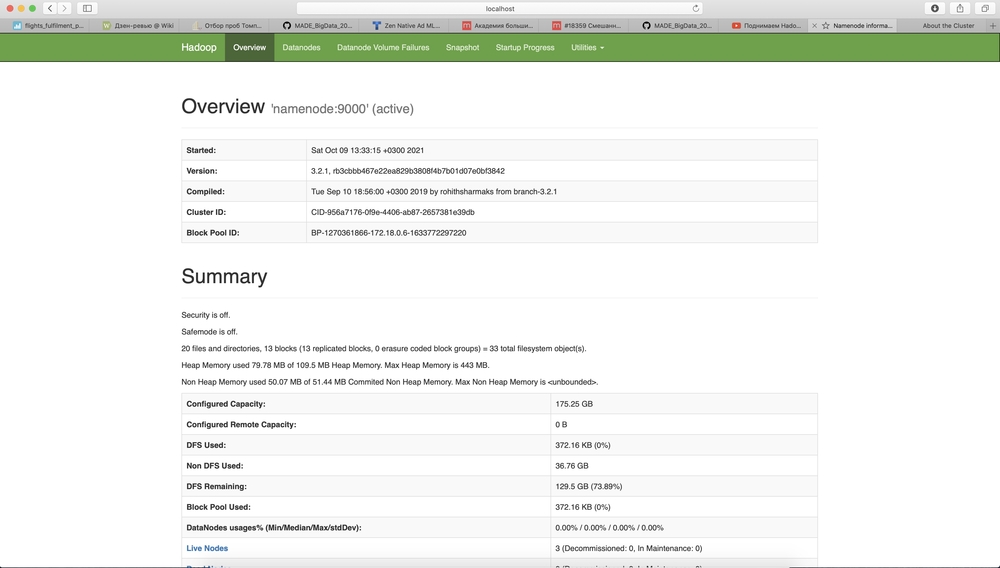
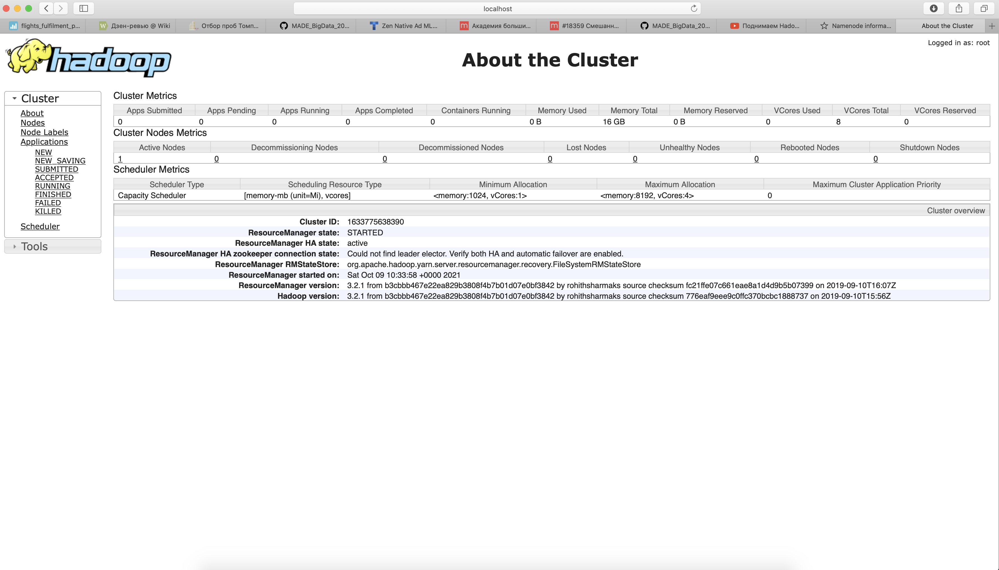

#Блок 1. Развертывание локального кластера Hadoop

#Блок 2. Работа с HDFS

docker exec -it namenode /bin/bash

hdfs dfs -mkdir /test_dir

hdfs dfs -mkdir /test_dir/new_dir

Корзина, которая хранит все недавно удаленные объекты пока не прошло N дней со времени удаления. hdfs dfs -rm -skipTrash <path>

hdfs dfs -touchz /test_dir/new_dir/test_file

hdfs dfs -rm -skipTrash  /test_dir/new_dir/test_file

hdfs dfs -rm -r -f /test_dir

____________________
docker cp /usr/share/calendar/calendar.history namenode:/
hdfs dfs -put /calendar.history /

hdfs dfs -cat /calendar.history

hdfs dfs -tail  /calendar.history

hdfs dfs -head  /calendar.history

hdfs dfs -cp -f  /calendar.history /new_path

_______________
hdfs dfs -setrep -w 1  /calendar.history
Увеличение значительно дольше, нужно разложить на дата ноды, собрать инфу на мастер ноде

hdfs fsck -blocks -files /

hdfs fsck -blockId blk_1073741845

#Блок 3. Написание map reduce на Python
|стандартный расчет| map-reduce|
|----------|:-------------:|
|152.7206871868289|152.7206871868289|
|57672.8456984336|57672.84569843365|
  