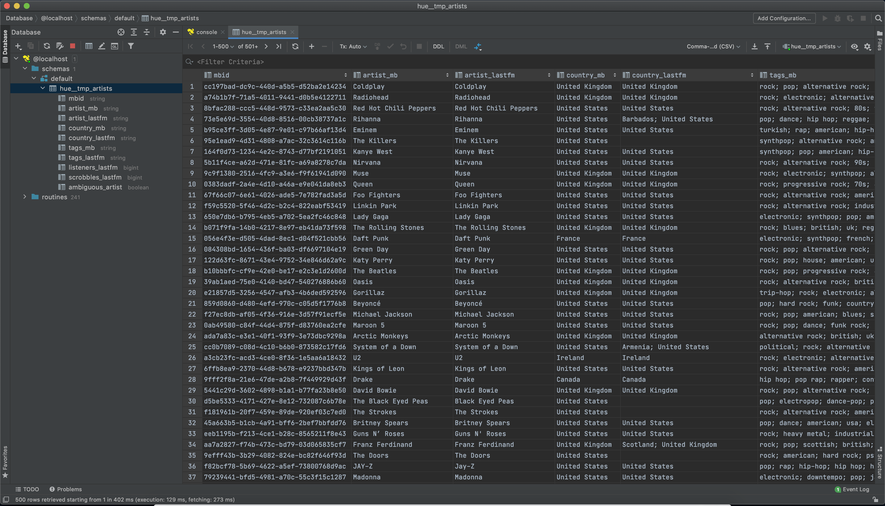
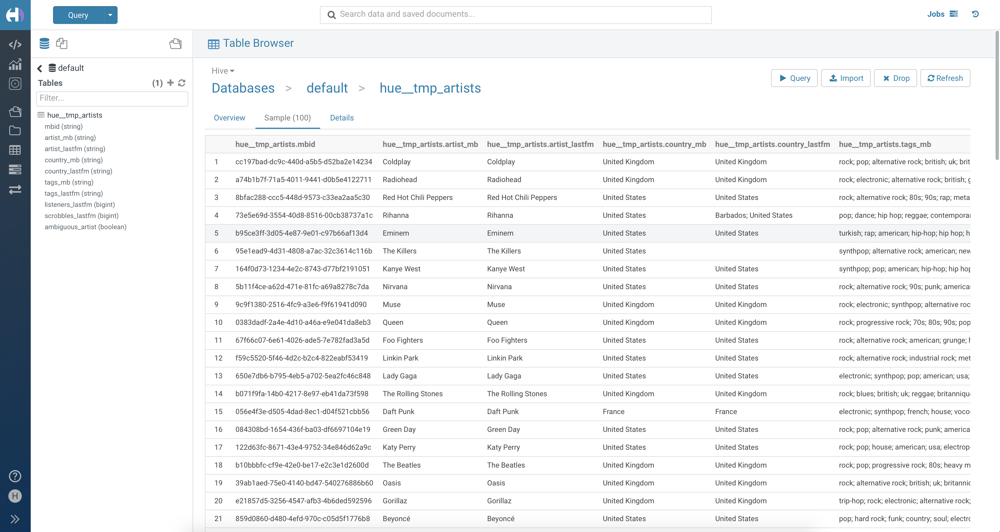

# Блок 1. Развертывание локального Hive




# Блок 2. Работа с Hive

Исполнителя с максимальным числом скробблов

```sql
USE default;

SELECT 
    artist_lastfm
    , scrobbles_lastfm
FROM hue__tmp_artists
ORDER BY scrobbles_lastfm DESC
LIMIT 1;
```

| artist_lastfm | scrobbles_lastfm |
| --- | --- |
| The Beatles | 517126254 |
____________________

Самый популярный тэг на ластфм

```sql
USE default;

SELECT 
    tag
    , COUNT(*) as cnt
FROM ( --tags
    SELECT
        trim(tag_dirty) as tag
        , artist_lastfm
    FROM hue__tmp_artists
        LATERAL VIEW explode(SPLIT(tags_lastfm, ';')) hue__tmp_artists AS tag_dirty
) as tags
WHERE tag != ''
GROUP BY tag
ORDER BY cnt DESC
LIMIT 1;
```

| tag | cnt |
| --- | --- |
| seen live | 99540 |

____________________

Самые популярные исполнители 10 самых популярных тегов ластфм

```sql
USE default;

WITH artist_tag_listners as (
    SELECT 
        tag
        , artist
        , listners
    FROM ( --tags
        SELECT
            trim(tag_dirty) as tag
            , artist_lastfm as artist
            , listeners_lastfm as listners
        FROM hue__tmp_artists
            LATERAL VIEW explode(SPLIT(tags_lastfm, ';')) hue__tmp_artists AS tag_dirty
    ) as tags
    WHERE tag != ''
),

top_tags as (
    SELECT 
        tag
        , SUM(listners) as cnt
    FROM artist_tag_listners
    GROUP BY tag
    ORDER BY cnt DESC
    LIMIT 10
),
	
artist_top_tag_listners as (
    SELECT
        tag
        , artist
        , SUM(listners) as listners
    FROM artist_tag_listners
    WHERE tag IN (SELECT tag FROM top_tags)
    GROUP BY artist, tag
)

SELECT
    tag
    , artist
    , listners
FROM ( -- top_listners_window
    SELECT
        tag
        , artist
        , listners
        , row_number() OVER (PARTITION BY tag ORDER BY listners DESC) AS r_n
    FROM artist_top_tag_listners
) as top_listners_window
WHERE r_n == 1
ORDER BY listners DESC
```

| id | tag | artist | listners |
| --- | --- | --- | --- |
| 1 | seen live | Phoenix | 28424886 |
| 2 | rock | Phoenix | 28424886 |
| 3 | pop | Phoenix | 28424886 |
| 4 | male vocalists | Phoenix | 28424886 |
| 5 | indie | Phoenix | 28424886 |
| 6 | electronic | Phoenix | 28424886 |
| 7 | alternative | Phoenix | 28424886 |
| 8 | 00s | Phoenix | 28424886 |
| 9 | american | Chris Brown | 13124285 |
| 10 | USA | John Williams | 9627944 |

____________________

Топ 3 исполнителя от топ 10 стран по прослушиваниям

```sql
USE default;

WITH artist_country_listners as (
    SELECT 
        trim(country_dirty) as country
        , artist_lastfm as artist
        , SUM(listeners_lastfm) as listners
    FROM hue__tmp_artists
            LATERAL VIEW explode(SPLIT(country_lastfm, ';')) hue__tmp_artists AS country_dirty
    GROUP BY country_dirty, artist_lastfm
),

top_countries as (
    SELECT 
        country
        , SUM(listners) as cnt
    FROM artist_country_listners
    WHERE country != ''
    GROUP BY country
    ORDER BY cnt DESC
    LIMIT 10
),
	
artist_listners as (
    SELECT
        artist
        , country
        , SUM(listners) as listners
    FROM artist_country_listners
    WHERE country IN (SELECT country FROM top_countries)
    GROUP BY artist, country
)

SELECT
    country
    , artist
    , listners
FROM ( -- top_listners_window
    SELECT
        country
        , artist
        , listners
        , row_number() OVER (PARTITION BY country ORDER BY listners DESC) AS r_n
    FROM artist_listners
) as artist_listners
WHERE r_n <= 3
ORDER BY country, listners DESC
```
 
| id | country | artist | listners |
| --- | --- | --- | --- |
| 1 | Australia | Jet | 5262465 |
| 2 | Australia | Eden | 3284292 |
| 3 | Australia | Odyssey | 3124720 |
| 4 | Canada | Feist | 5900148 |
| 5 | Canada | Drake | 3379644 |
| 6 | Canada | Eden | 3284292 |
| 7 | France | Phoenix	 | 8424886 |
| 8 | France | Sebastian | 4885461 |
| 9 | France | Daft Punk | 3782404 |
| 10 | Germany | Plan B | 5507433 |
| 11 | Germany | Poison | 3840970 |
| 12 | Germany | Brainstorm | 3345252 |
| 13 | Japan | Mono | 4693564 |
| 14 | Japan | Ghost | 4572763 |
| 15 | Japan | Eve | 3562608 |
| 16 | Russia | Brainstorm | 3345252 |
| 17 | Russia | Eden | 3284292 |
| 18 | Russia | Max | 1960690 |
| 19 | Spain | Lena | 3046043 |
| 20 | Spain | Shakira | 2346168 |
| 21 | Spain | Nelly Furtado | 2258851 |
| 22 | Sweden | Passenger | 6499619 |
| 23 | Sweden | Ghost | 4572763 |
| 24 | Sweden | Odyssey | 3124720 |
| 25 | United Kingdom | Passenger | 6499619 |
| 26 | United Kingdom | Plan B | 5507433 |
| 27 | United Kingdom | Coldplay | 5381567 |
| 28 | United States | Chris Brown | 3124285 |
| 29 | United States | John Williams | 9627944 |
| 30 | United States | Passenger | 6499619 |
